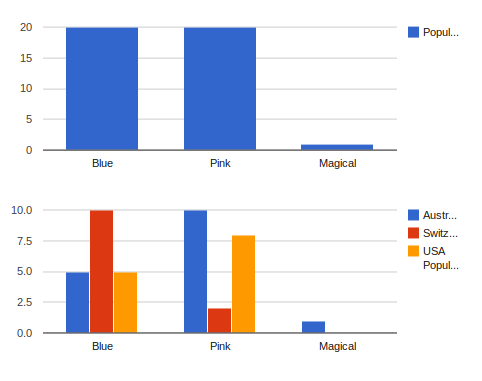
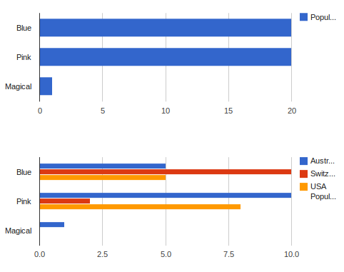
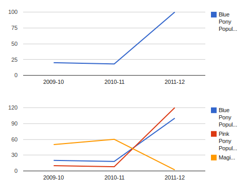

Charts
======

.. py:class:: report_tools.charts.Chart(**kwargs)

Charts represent a view of your data. Charts are usually a graph of some sort,
but may also contain arbitrary HTML (see the TemplateChart class)

Optional Chart Arguments
------------------------

title
~~~~~

.. attribute:: Chart.title

A "human-friendly" title for your chart. Note that this field will typically 
not be rendered in the chart itself - it is provided for use in the surrounding 
HTML. For example:

.. code-block:: django

    <h2 class="chart-title">{{ my_report.chart.title }}</h2>
    
{{ my_report.chart }}

If you want to embed a title in the chart itself, you should refer to
the :doc:`renderer documentation </renderers/index>` for your chosen rendering engine.

renderer
~~~~~~~~

.. attribute:: Chart.renderer

If you want the chart to use a different renderer to the one specified on the report,
you can use this to pass in the appropriate renderer class.

renderer_options
~~~~~~~~~~~~~~~~

.. attribute:: Chart.renderer_options

Renderers will typically have a lot of specific customization options. This
argument accepts a dictionary, which will be passed through to the renderer.
For available options, check out the :doc:`renderer 
documentation </renderers/index>`.

attrs
~~~~~

.. attribute:: Chart.attrs

If you want to store some extra information with the chart (i.e. what sort of
container div should it use?), you can pass in a dictionary of attributes with
this argument.

Built-in Chart Classes
------------------------

PieChart
~~~~~~~~

.. py:class:: report_tools.charts.PieChart(width=None, height=None, **kwargs)

A standard pie chart. The corresponding ``get_data_for_xxx`` method should
provide a ``ChartData`` object with two columns. Column one should contain the data 
point labels, and column 2 should contain numerical values.

Accepts two extra keyword arguments, *width* and *height*. These can be integers,
floats or strings, depending on what your chosen rendering engine supports.

Example:

.. literalinclude:: pie_chart_example.py
    :language: python

.. image:: pie_chart_example.png

ColumnChart
~~~~~~~~~~~

.. py:class:: report_tools.charts.ColumnChart(width=None, height=None, **kwargs)

A standard vertical column chart. The corresponding ``get_data_for_xxx`` method should
provide a ChartData object with 1+n columns, where n is the number of data series
to be displayed. Column one should contain the data point labels, and subsequent columns
should contain numerical values.

Accepts two extra keyword arguments, *width* and *height*. These can be integers,
floats or strings, depending on what your chosen rendering engine supports.

Example:

.. literalinclude:: column_chart_example.py
    :language: python

BarChart
~~~~~~~~

.. py:class:: report_tools.charts.BarChart(width=None, height=None, **kwargs)

A standard horizontal bar chart. The corresponding ``get_data_for_xxx`` method should
provide a ChartData object with 1+n columns, where n is the number of data series
to be displayed. Column one should contain the data point labels, and subsequent columns
should contain numerical values.

Accepts two extra keyword arguments, *width* and *height*. These can be integers,
floats or strings, depending on what your chosen rendering engine supports.

Example:

.. literalinclude:: bar_chart_example.py
    :language: python

LineChart
~~~~~~~~~

.. py:class:: report_tools.charts.LineChart(width=None, height=None, **kwargs)

A standard line chart. The corresponding ``get_data_for_xxx`` method should
provide a ChartData object with 1+n columns, where n is the number of data series
to be displayed. Column one should contain the data point labels, and subsequent columns
should contain numerical values.

Example:

.. literalinclude:: line_chart_example.py
    :language: python

TemplateChart
~~~~~~~~~~~~~

.. py:class:: report_tools.charts.TemplateChart(template, **kwargs)

This chart simply renders a given template. The ``get_data_for_xxx`` method
should return a dictionary context. An extra context variable 'chart_id' will
be provided, which should be used if a unique identifier is required in the
template. Note that the template chart does not require a renderer.

Accepts one required argument, *template*.

Example:

.. literalinclude:: template_chart_example.py
    :language: python

.. literalinclude:: template_chart_example_template.html
    :language: html
