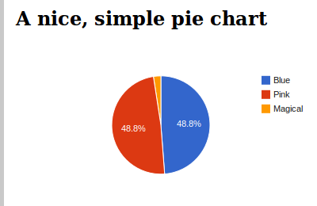

Getting Started
===============

Overview
--------

This library deals with the following concepts:

Report
  A class that maintains a collection of charts
  
Chart
  A class that, given a set of options and a set of data, generates HTML to
  display that data in a nice format. Charts can include graphs, tables,
  and other arbitrary visualization types.
  
ChartData
  A class that allows the collection of data in a structured format, which can
  then be passed into a Chart.
  
ChartRenderer
  A class that implements the rendering of Chart objects. Changing the
  ChartRenderer class for a Report or Chart allows for easy changing of
  rendering technologies - i.e. google charts, FusionCharts, HighCharts etc.

ReportView
  A class-based view to assist with the creation of a report API. More information
  in the :doc:`API documentation </api/index>`.

Report objects
--------------

Consider the following, very simple report - this would usually be located in a 
``reports.py`` file in your app directory:

.. literalinclude:: reports.py
   :language: python

A ``Report`` is composed of ``Chart`` objects. In this case, the report has a single
chart ``pie_chart``. This chart has been given a title, width and height, but other than
that it will use the default rendering options.

For information on the available ``Chart`` classes, see the :doc:`Chart documentation </charts/index>`.

Rendering for this report will be performed by the ``GoogleChartsRenderer`` class,
which uses Google's visualization framework. For more information on the available
rendering classes, see the :doc:`renderer documentation </renderers/index>`.

All charts on a report require a ``get_data_for_xxx`` method, where ``xxx`` is the
attribute name given to the chart. In this case, you can see the ``get_data_for_pie_chart``
field has been created. Pie charts require a ``ChartData`` object as input, so
the ``get_data_for_pie_chart`` method creates one, fills it with data and returns it.
For detailed information on how to enter data into a ``ChartData`` object or other
data storage formats, see the :doc:`ChartData documentation </chart_data/index>`.

Using a report in your views
----------------------------

Using a report in your view is simple:

.. literalinclude:: views.py
   :language: python

You can also use the included class based view, which will help if you wish to
use API features down the track:

.. literalinclude:: views_class.py
   :language: python
   
Note the use of the ``get_report`` method. This provides the hook required for the API
to grab the report. For more information, check the  :doc:`API documentation </api/index>`.

Using a report in your templates
--------------------------------

Using a report in your template is also straightforward

.. literalinclude:: template.html
   :language: html

