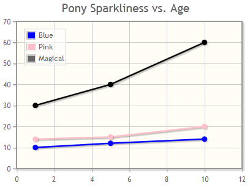

jqPlot
======

.. class:: report_tools.renderers.jqplot.JQPlotRenderer

The jqPlot charts renderer uses 
`jqPlot <http://www.jqplot.com>`_ by Chris Leonello
to render the built-in chart types.

Prerequisites
-------------

To use the basic charts with no extra plugins, you must import the following scripts from the jqPlot source:

.. code-block:: html

    jquery.jqplot.min.js
    plugins/jqplot.pieRenderer.js
    plugins/jqplot.categoryAxisRenderer.js
    plugins/jqplot.barRenderer.js

You will also need to include a jquery distribution, along with any plugins you define in your
custom renderer options.

Chart Support
-------------

The jqPlot renderer supports all the built-in chart types described
in the :doc:`chart documentation </charts/index>`. This includes:

*   Pie Charts
*   Column Charts
*   Multi-series Column Charts
*   Bar Charts
*   Multi-series Bar Charts
*   Line Charts
*   Multi-series Line Charts

Each of these chart types provides a set of basic rendering options
to jqPlot. These are outlined below.

Renderer Options
----------------

The ``renderer_options`` dictionary for charts using the jqPlot renderer
is JSON encoded and passed into the chart initialization javascript. A few things to keep in mind:

* A 'base set' of renderer options is provided for each core chart type - read on to the next section for more information.
* Any option with the name 'formatter', 'renderer' or 'markerRenderer' will render without quotes (i.e. as raw javascript) 
  when fed into the chart. This approach is required because jqPlot needs javascript objects such as
  ``$.jqplot.BarRenderer`` instead of string-based options. If you need to replicate this behaviour for
  an option not labelled 'formatter' or 'renderer', you can wrap the string using 'report_tools.renderers.jqplot.JSRaw'.

Read the `jqPlot documentation <http://www.jqplot.com/docs/files/jqPlotOptions-txt.html>`_ for more information on the huge number of available options.
.com/chart/interactive/docs/gallery/linechart>`_

Default Renderer Options
------------------------

A 'base set' of renderer options is provided for each chart type, with the exception of the
special JQPlotChart class (which gives you a blank slate to work from). 

Note that custom renderer options you define will 'gently' update these options - 
i.e. if you change ``renderer_options['axes']['xaxis']['renderer']`` then
``renderer_options['axes']['xaxis']['ticks']`` will still be there. This way you can safely update
options at any level of the dictionary without fear of clobbering the chart defaults.

Pie Charts
^^^^^^^^^^

.. code-block:: python

        {
            'seriesDefaults': {
                'renderer': '$.jqplot.PieRenderer',
                'rendererOptions': {
                    'showDataLabels': True,
                },
            },
            'legend': {
                'show': True,
            }
        }

Column and Multi-series Column Charts
^^^^^^^^^^^^^^^^^^^^^^^^^^^^^^^^^^^^^

.. code-block:: python

    {
        'seriesDefaults': {
            'renderer': '$.jqplot.BarRenderer',
            'pointLabels': {
                'show': True,
            }
        },
        'legend': {
            'show': True,
        },
        'axes': {
            'xaxis': {
                'renderer': '$.jqplot.CategoryAxisRenderer',
                'ticks': [<FIRST_ROW_ITEM_FROM_CHART_DATA>, ...],
            }
        },
        'series': [{'label': <COLUMN_NAME_FROM_CHART_DATA>}, ...],
    }

Bar and Multi-series Bar Charts
^^^^^^^^^^^^^^^^^^^^^^^^^^^^^^^

.. code-block:: python

    {
        'seriesDefaults': {
            'renderer': '$.jqplot.BarRenderer',
            'rendererOptions': {
                'barDirection': 'horizontal',
            },
            'pointLabels': {
                'show': True,
            },
        },
        'legend': {
            'show': True,
        },
        'axes': {
            'yaxis': {
                'renderer': '$.jqplot.CategoryAxisRenderer',
                'ticks': [<FIRST_ROW_ITEM_FROM_CHART_DATA>, ...],
            }
        },
        'series': [{'label': <COLUMN_NAME_FROM_CHART_DATA>}, ...],
    }

Line and Multi-series Line Charts
^^^^^^^^^^^^^^^^^^^^^^^^^^^^^^^^^

.. code-block:: python

    {
        'seriesDefaults': {
            'pointLabels': {
                'show': True,
            },
        },
        'legend': {
            'show': True,
        },
        'axes': {
            'xaxis': {
                'renderer': '$.jqplot.CategoryAxisRenderer',
                'ticks': [<FIRST_ROW_ITEM_FROM_CHART_DATA>, ...],
            }
        },
        'series': [{'label': <COLUMN_NAME_FROM_CHART_DATA>}, ...],
    }

Extra Charts
------------

One additional chart type is provided for the jqPlotRenderer:

JQPlotChart
^^^^^^^^^^^

.. py:class:: report_tools.charts.jqplot.JQPlotChart(width=None, height=None, **kwargs)

This chart has been provided to give you a more direct interface to jqPlot. While the inbuilt
chart classes provide default rendering options and wrangle ChartData into an appropiate format,
JQPlot charts are a blank slate. No default rendering options are provided, and instead of a ChartData object,
the 'get_data_for' method should just provide a simple Python array.

Example:

.. literalinclude:: jqplot_chart_example.py
    :language: python

Tips and Tricks
---------------

If you need to override the default html/javascript that the jqPlot renderer creates,
you can override the default template at:

*   ``report_tools/renderers/jqplot/chart.html``
